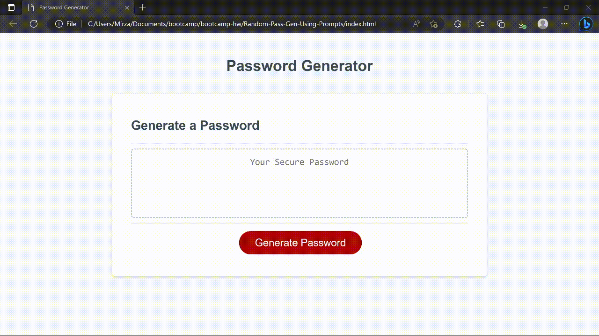

# Random Password Generator Using Prompts
This password generator was creating using `javascript` and `prompts`. It will generate you a secure password that will include `lower case`, `upper case`, `numbers`, and `symbols` if the user chooses those options.

## Usage
- - -

To use this password generator just click the `Generate Buton` and you will be prompted with your choices !



## Criteria Followed
- - -

When creating this generator, I had to follow the given criteria which is as followed:

```
GIVEN I need a new, secure password
WHEN I click the button to generate a password
THEN I am presented with a series of prompts for password criteria
WHEN prompted for password criteria
THEN I select which criteria to include in the password
WHEN prompted for the length of the password
THEN I choose a length of at least 8 characters and no more than 128 characters
WHEN asked for character types to include in the password
THEN I confirm whether or not to include lowercase, uppercase, numeric, and/or special characters
WHEN I answer each prompt
THEN my input should be validated and at least one character type should be selected
WHEN all prompts are answered
THEN a password is generated that matches the selected criteria
WHEN the password is generated
THEN the password is either displayed in an alert or written to the page
```

## Creating a fallback for incorrect input
- - -

The one problem that I came across however was trying to create a fallback for when the user inputs either a non numeric value or a numeric valued outside of the given range.

To do this I created this piece of code:

```
if (!userInt) {
    alert("Please input a numeric value.")
    return generatePassword()
} else if (userInt < 8 || userInt > 128) {
    alert("Please input a value between 8 & 128.")
    return generatePassword()
} else {
    console.log('criteria met')

    var confirmLower = confirm("Include Lower Case?");
    var confirmUpper = confirm("Include Upper Case?");
    var confirmNums = confirm("Include Numbers?");
    var confirmSyms = confirm("Include Symbols?");
}
```

### How this code works
- - - 

Since previously I used `parseInt` on my prompt it returns our `userInt` as a numeric value. Therfore if the `userInt` is not a numeric value it will return and alert telling the user that they must input a numeric value. This then breaks using `return` and restarts the `generatePassword` function until the criteria is met which will then prompt us with out `confirm` prompts.

## Conclusion
- - -

The password generator is fully functional and available to view at: https://kankanrr.github.io/Random-Pass-Gen-Using-Prompts/
